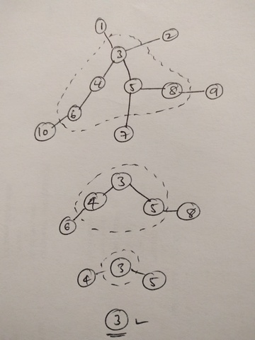

[310. Minimum Height Trees](https://leetcode.com/problems/minimum-height-trees/)

* Amazon
* Breadth-First Search, Graph
* Similar Questions:
    * 207.Course Schedule
    * 210.Course Schedule II
* Hints:
    * How many MHTs can a graph have at most?
    
    
## Method 1. [Share some thoughts](https://leetcode.com/problems/minimum-height-trees/discuss/76055/Share-some-thoughts)
> Graph Theory:
> 1. A tree is an undirected graph in which any two vertices are connected by exactly one path. 
> 2. Any connected graph who has n nodes with n-1 edges is a tree.
> 3. The degree of a vertex of a graph is the number of edges incident to the vertex.
> 4. A leaf is a vertex of degree 1. An internal vertex is a vertex of degree at least 2.
> 5. A path graph is a tree with two or more vertices that is not branched at all.
> 6. A tree is called a rooted tree if one vertex has been designated the root.
> 7. The height of a rooted tree is the number of edges on the longest downward path between root and a leaf.

* 此时还是用 `HashSet` 来表示和与一个 node 相连接的 node，因为 `list.remove(idx)` 难以删除特定的 `node`。



```java 
class Solution {
    public List<Integer> findMinHeightTrees(int n, int[][] edges) {
        if(n <= 1) {
            return Arrays.asList(0);
        }
        
        List<Set<Integer>> graph = new ArrayList<>();
        for(int i=0; i<n; i++) {
            graph.add(new HashSet<>());
        }
        for(int[] edge: edges) {
            graph.get(edge[0]).add(edge[1]);
            graph.get(edge[1]).add(edge[0]);
        }
        
        List<Integer> leaves = new ArrayList<>();
        for(int i=0; i<n; i++) {
            if(graph.get(i).size() == 1) {
                leaves.add(i);
            }
        }
        
        while(n > 2) {
            n -= leaves.size();
            List<Integer> newLeaves = new ArrayList<>();
            for(int i: leaves) {
                int j = graph.get(i).iterator().next();
                graph.get(j).remove(i);
                if(graph.get(j).size() == 1) {
                    newLeaves.add(j);
                }
            }
            leaves = newLeaves;
        }
        return leaves;
    }
}
```

or 

```java 
class Solution {
    public List<Integer> findMinHeightTrees(int n, int[][] edges) {
        if(n <= 1) {
            return Arrays.asList(0);
        }
        
        Set<Integer>[] graph = new HashSet[n];
        for(int i=0; i<n; i++) {
            graph[i] = new HashSet<Integer>();
        }
        for(int[] edge: edges) {
            graph[edge[0]].add(edge[1]);
            graph[edge[1]].add(edge[0]);
        }
        
        List<Integer> leaves = new ArrayList<>();
        for(int i=0; i<n; i++) {
            if(graph[i].size() == 1) {
                leaves.add(i);
            }
        }
        
        while(n > 2) {
            n -= leaves.size();
            List<Integer> newLeaves = new ArrayList<>();
            for(int i: leaves) {
                int j = graph[i].iterator().next();
                graph[j].remove(i);
                if(graph[j].size() == 1) {
                    newLeaves.add(j);
                }
            }
            leaves = newLeaves;
        }
        return leaves;
    }
}
```


## Method 2. [Breadth-First Search based on inDegree (faster)](https://leetcode.com/problems/minimum-height-trees/discuss/76055/Share-some-thoughts)
>  Instead of using set, and update set to get the indegree information, I use a explicit indegree array...which will be more efficient...

```java 
class Solution {
    public List<Integer> findMinHeightTrees(int n, int[][] edges) {
        List<Integer> res = new ArrayList<>();
        if (n <= 0) return res;
        //this is needed...since when there is only 1 vertex... the indegree of it will be 0..this case is not included in the following discussion...
        if (n == 1) {
            res.add(0);
            return res;
        }
        List<Integer>[] graph = (ArrayList<Integer>[]) new ArrayList[n];
        for (int i = 0; i < n; i++) {
            graph[i] = new ArrayList<>();
        }
        
        for (int[] e : edges) {
            graph[e[0]].add(e[1]);
            graph[e[1]].add(e[0]);
        }
        
        int[] indegree = new int[n];
        int cnt = n;
        Queue<Integer> leaves = new LinkedList<>();
        for (int i = 0; i < n; i++) {
            indegree[i] = graph[i].size();
            if (indegree[i] == 1) {
                leaves.add(i);
            }
        }
        while (cnt > 2) {
            int size = leaves.size();
            cnt -= size;
            for (int i = 0; i < size; i++) {
                int v = leaves.poll();
                for (int w : graph[v]) {
                    indegree[w]--;
                    if (indegree[w] == 1) {
                        leaves.add(w);
                    }
                }
            }
        }
        res.addAll(leaves);
        return res;
    }          
}
```


## My Solution (Time Limit Exceeded)
```java 
class Solution {
    public List<Integer> findMinHeightTrees(int n, int[][] edges) {
        int[] heights = new int[n];
        
        // Initialize the graph
        List<Integer>[] graph = new ArrayList[n];
        for(int i=0; i<n; i++) {
            graph[i] = new ArrayList<Integer>();
        }
        for(int[] edge: edges) {
            graph[edge[0]].add(edge[1]);
            graph[edge[1]].add(edge[0]);
        }
        
        int min = Integer.MAX_VALUE;
        for(int i=0; i<n; i++) {
            heights[i] = bfs(graph, new boolean[n], i);
            min = Math.min(min, heights[i]);
        }
        
        List<Integer> res = new ArrayList<Integer>();
        for(int i=0; i<n; i++) {
            if(heights[i] == min) {
                res.add(i);
            }
        }
        return res;
    }
    
    private int bfs(List<Integer>[] graph, boolean[] visited, int start) {
        Queue<Integer> queue = new LinkedList<Integer>();
        queue.add(start);
        visited[start] = true;
        int height = 0;
        while(!queue.isEmpty()) {
            int size = queue.size();
            for(int i=0; i<size; i++) {
                int curr = queue.poll();
                for(int next: graph[curr]) {
                    if(!visited[next]) {
                        queue.offer(next);
                        visited[next] = true;
                    }
                }
            }
            height++;
        }
        return height;
    }
}
```

