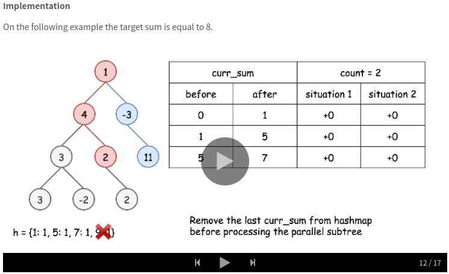

[437. Path Sum III](https://leetcode.com/problems/path-sum-iii/)

* Amazon, Microsoft, Facebook, Oracle
* Tree
* Similar Questions:
    * Path Sum
    * Path Sum II
    * Path Sum IV
    * Longest Univalue Path
    

## Prefix Sum: One pass + linear time complexity
> **Prefix Sum** is a sum of the current value with all previous elements starting from the beginning of the structure.     
> **Prefix Sum** 是从结构开始，到当前 value 的总和。
    
## Method 1. Prefix Sum

```java 
/**
 * Definition for a binary tree node.
 * public class TreeNode {
 *     int val;
 *     TreeNode left;
 *     TreeNode right;
 *     TreeNode() {}
 *     TreeNode(int val) { this.val = val; }
 *     TreeNode(int val, TreeNode left, TreeNode right) {
 *         this.val = val;
 *         this.left = left;
 *         this.right = right;
 *     }
 * }
 */
class Solution {
    private int count = 0;
    private HashMap<Integer, Integer> map = new HashMap<>();
    private int k;
    
    public int pathSum(TreeNode root, int sum) {
        k = sum;
        preorder(root, 0);
        return count;
    }
    
    private void preorder(TreeNode node, int currSum) {
        if(node == null) {
            return;
        }
        
        // Current prefix sum
        currSum += node.val;
        
        // Situation 1:
        // Here is the sum we're looking for
        if(currSum == k) {
            count++;
        }
        
        // Situation 2:
        // Number of times the currSum-k has occured already.
        // Determine the number of times a path with sum k has occured upto the current node
        count += map.getOrDefault(currSum - k, 0);
        
        // Add the currSum into HashMap to use it during the child nodes processing
        map.put(currSum, map.getOrDefault(currSum, 0) + 1);
        
        // Process the left subtree
        preorder(node.left, currSum);
        // Process the right subtree
        preorder(node.right, currSum);
        
        // Remove the current sum from the HashMap in order not to use it during the parallel subtree processing
        map.put(currSum, map.get(currSum) - 1);
    }
}
```
Complexity Analysis

    Time complexity: O(N), where N is a number of nodes. During preorder traversal, each node is visited once.
    Space complexity: up to O(N) to keep the hashmap of prefix sums, where NNN is a number of nodes.
