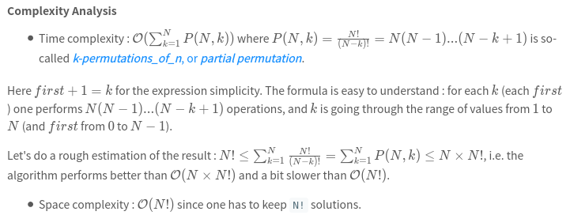

[46. Permutations](https://leetcode.com/problems/permutations/)

* Amazon, Microsoft, Facebook, Google, Apple, LinkedIn, eBay, Yahoo, Oracle, Uber, Atlassian, ByteDance
* Backtracking
* Similar Questions:
    * Next Permutation
    * Permutations II
    * Permutation Sequence
    * Combinations
    
  
## Method 1. Backtracking
> **Backtracking** is an algorithm for finding all solutions by exploring all potential candidates.         
> [**Backtracking** 是一种查找所有可能结果的算法。]                
> If the solution candidate turns to be *not* a solution (or at least not the *last* one), backtracking algorithm discards it by making some changes on the previous step, i.e. **backtracks** and then try again.
>
> Here is a backtrack function which takes the index of the first integer to consider as an argument `backtrack(first)`:
> * If the parameter `first` to be considered has index `n` that means that the current permutation is done.
> * Iterate over the integers from index `first` to index `n-1`:
>   * Place `i-th` integer in `first` position, i.e. `swap(nums[first], nums[i])`;
>   * Proceed to create all permutations which starts from `i-th` integer: `backtrack(first + i)`;
>   * Now backtrack, i.e. `swap(nums[first], nums[i])` back.

```java 
class Solution {
    public List<List<Integer>> permute(int[] nums) {
        List<List<Integer>> res = new ArrayList<List<Integer>>();
        backtrack(res, nums, 0);
        return res;
    }
    
    private void backtrack(List<List<Integer>> res, int[] nums, int start) {
        if(start == nums.length) {
            List<Integer> tmp = new ArrayList<Integer>();
            for(int num: nums) {
                tmp.add(num);
            }
            res.add(tmp);
            return;
        } 
        for(int i=start; i<nums.length; i++) {
            swap(nums, start, i);
            backtrack(res, nums, start+1);
            swap(nums, start, i);
        }
    }
    
    private void swap(int[] nums, int i, int j) {
        int tmp = nums[i];
        nums[i] = nums[j];
        nums[j] = tmp;
    }
}
```


## Method 2. Backtracking
```java 
class Solution {
    public List<List<Integer>> permute(int[] nums) {
        // Init the res list
        List<List<Integer>> res = new ArrayList<List<Integer>>();
        
        // Convert nums into list since the output is a list of lists
        ArrayList<Integer> numsList = new ArrayList<Integer>();
        for(int num: nums) {
            numsList.add(num);
        }
        
        backtrack(res, numsList, nums.length, 0);
        return res;
    }
    
    private void backtrack(List<List<Integer>> res, List<Integer> nums, int n, int first) {
        // If all integers are used up
        if(first == n) {
            res.add(new ArrayList<Integer>(nums));
        }
        
        for(int i=first; i<n; i++) {
            // Place i-th integer first in the current permutation
            Collections.swap(nums, first, i);
            // Use rest integers to complete the permutations
            backtrack(res, nums, n, first+1);
            // Backtrack
            Collections.swap(nums, first, i);
        }
    }
}
```

* For k-permutations of n numbers, the time complexity is `O(Sigma P(N, k)), when P(N, k) = N! / (N-k)! = N * (N-1) ... * (N - k + 1`
* 如果只有 1 个 element，
* 如果有 2 个 elements，
* 如果有 3 个 elements，
* ...
* 如果有 n 个 elements，

Complexity: [k-permutation of n](https://en.wikipedia.org/wiki/Permutation#k-permutations_of_n) 
