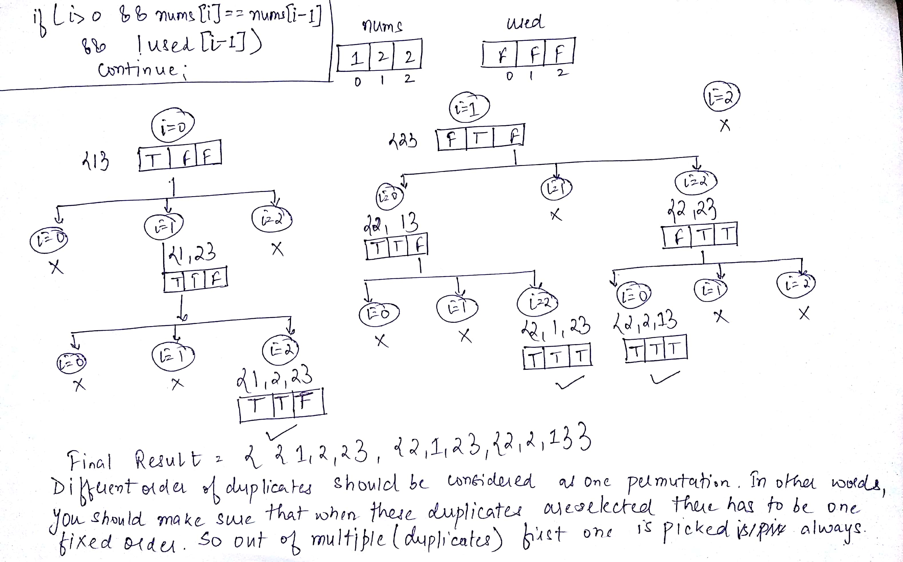
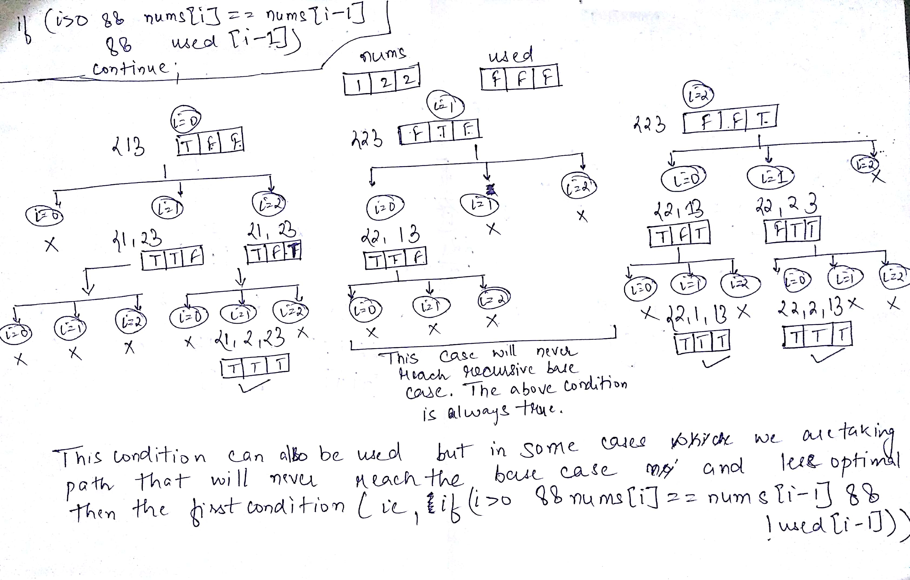

[47. Permutations II](https://leetcode.com/problems/permutations-ii/)

* Bloomberg, Apple
* Backtracking
* Similar Questions
    * Next Permutation
    * Permutations
    * Palindrome Permutation II
    * Number of Squareful Arrays
    
    
## Method 1. Backtrack
* The solution is similar to that of **46.Permutations**.
* When swapping between `nums[first]` and `nums[i]`, we must must sure that `nums[i]` isn't used before.
[也就是如果 `nums[i]` 已经和 `nums[first]` 交换过了，则不再将 `nums[i]` 和 `nums[first]` 进行交换。]
 
```java 
class Solution {
    public List<List<Integer>> permuteUnique(int[] nums) {
        List<List<Integer>> res = new ArrayList<List<Integer>>();
        backtrack(res, nums, 0);
        return res;
    }
    
    private void backtrack(List<List<Integer>> res, int[] nums, int start) {
        if(start == nums.length) {
            List<Integer> tmp = new ArrayList<Integer>();
            for(int num: nums) {
                tmp.add(num);
            }
            res.add(tmp);
            return;
        }
        Set<Integer> set = new HashSet<Integer>();
        for(int i=start; i<nums.length; i++) {
            if(!set.add(nums[i])) { // If nums[start] is already replaced by nums[i], skip
                continue;
            }
            swap(nums, start, i);
            backtrack(res, nums, start+1);
            swap(nums, start, i);
        }
    }
    
    private void swap(int[] nums, int i, int j) {
        int tmp = nums[i];
        nums[i] = nums[j];
        nums[j] = tmp;
    }
}
```


## Method 2. Backtrack
[Really easy Java solution, much easier than the solutions with very high vote](https://leetcode.com/problems/permutations-ii/discuss/18594/Really-easy-Java-solution-much-easier-than-the-solutions-with-very-high-vote)

* Use an extra boolean array `boolean[] used` to indicate whether the value is added to list;
* Sort the array `int[] nums` to make sure we can skip the same value;
* When a number has the same value with its previous, we can use this number only if its previous is used.




比较 `condition 1` 和 `condition 2` 都可以工作，但是 `condition 1(!used[i-1])` 效率更高。

```java 
class Solution {
    public List<List<Integer>> permuteUnique(int[] nums) {
        List<List<Integer>> res = new ArrayList<List<Integer>>();
        if(nums == null || nums.length == 0) {
            return res;
        }
        
        boolean[] used = new boolean[nums.length];
        Arrays.sort(nums);
        List<Integer> list = new ArrayList<Integer>();
        
        dfs(nums, used, list, res);
        return res;
    }
    
    private void dfs(int[] nums, boolean[] used, List<Integer> list, List<List<Integer>> res) {
        if(list.size() == nums.length) {
            res.add(new ArrayList<Integer>(list));
            return;
        }
        
        for(int i=0; i<nums.length; i++) {
            if(used[i]) {
                continue;
            }
            // When a number has the same value with its previous, we can use this number only if its previous is used.
            if(i > 0 && nums[i-1] == nums[i] && !used[i-1]) {
                continue;
            }
            used[i] = true;
            list.add(nums[i]);
            dfs(nums, used, list, res);
            used[i] = false;
            list.remove(list.size() - 1);
        }
    }
}
```