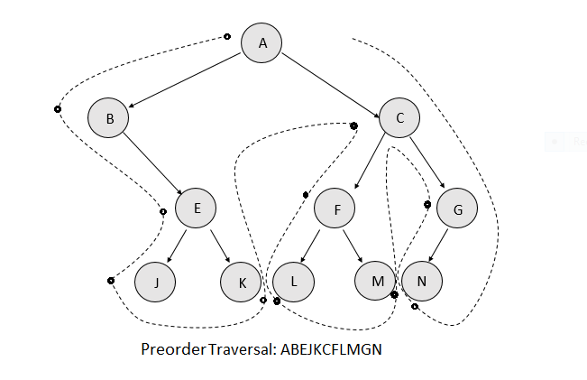

[545. Boundary of Binary Tree](https://leetcode.com/problems/boundary-of-binary-tree/)

* Microsoft, Amazon, eBay, Apple, Oracle, Audible
* Tree
* Similar Questions:
    * 199.Binary Tree Right Side View
 

## Method 2. Fastest
```java 
class Solution {
    public List<Integer> boundaryOfBinaryTree(TreeNode root) {
        List<Integer> result = new ArrayList<>();
        if (root == null) {
            return result;
        }
        result.add(root.val);
        helper(result, root.left, true, false);
        helper(result, root.right, false, true); 
        return result;
    }
    
    private void helper(List<Integer> result, TreeNode root, boolean leftMost, boolean rightMost) {
        if (root == null) {
            return;
        }
        if (leftMost || root.left == null && root.right == null) {
            result.add(root.val);
        }
        
        helper(result, root.left, leftMost, root.right == null ? rightMost : false);
        helper(result, root.right, root.left == null ? leftMost : false, rightMost);
        
        if (rightMost && !(leftMost) && !(root.left == null && root.right == null)) {
            result.add(root.val);
        }
    }
}
```   
    
## Method 1. Simple Solution
> One simple approach is to divide this problem into three subproblems: left-boundary, leaves and right-boundary.

```java 
/**
 * Definition for a binary tree node.
 * public class TreeNode {
 *     int val;
 *     TreeNode left;
 *     TreeNode right;
 *     TreeNode() {}
 *     TreeNode(int val) { this.val = val; }
 *     TreeNode(int val, TreeNode left, TreeNode right) {
 *         this.val = val;
 *         this.left = left;
 *         this.right = right;
 *     }
 * }
 */
class Solution {
    public List<Integer> boundaryOfBinaryTree(TreeNode root) {
        List<Integer> res = new ArrayList<Integer>();
        if(root == null) {
            return res;
        }
        if(!isLeaf(root)) { // If the root is not a leaf
            res.add(root.val);
        }
        TreeNode curr = root.left;
        while(curr != null) {   // add left boundary
            if(!isLeaf(curr)) {
                res.add(curr.val);
            }
            if(curr.left != null) {
                curr = curr.left;
            } else {
                curr = curr.right;
            }
        }
        addLeaves(res, root);   // add leaves
        
        Stack<Integer> stack = new Stack<Integer>();    // add right boundary
        curr = root.right;
        while(curr != null) {
            if(!isLeaf(curr)) {
                stack.push(curr.val);
            }
            if(curr.right != null) {
                curr = curr.right;
            } else {
                curr = curr.left;
            }
        }
        while(!stack.isEmpty()) {
            res.add(stack.pop());
        }
        
        return res;
    }
    
    // Is the node a leaf or not?
    private boolean isLeaf(TreeNode node) {
        return (node.left == null) && (node.right == null);
    }
    
    // Add leaves
    private void addLeaves(List<Integer> res, TreeNode root) {
        if(isLeaf(root)) {
            res.add(root.val);
        } else {
            if(root.left != null) {
                addLeaves(res, root.left);
            } 
            if(root.right != null) {
                addLeaves(res, root.right);
            }
        }
    }
}
```
Complexity Analysis

    Time complexity : O(n) One complete traversal for leaves and two traversals upto depth of binary tree for left and right boundary.
    Space complexity : O(n) resresres and stackstackstack is used.


## Method 2. Using Preorder traversal

> From the figure above, we can observe that our problem statement is very similar to the preorder traversal.
> Actually, the order of the traversal is the same (except for the right boundary nodes, for which it is the reverse), but we need to selectively include the nodes in the return result list.
> In order to distinguish between the various kinds of nodes, we make use of a flagflagflag as follows:
> * Flag=0: Root Node.
> * Flag=1: Left Boundary Node.
> * Flag=2: Right Boundary Node.
> * Flag=3: Others(Middle Node).
>
> We go for the normal preorder traversal, but while calling the recursive function for preorder traversal using the left child or the right child of the current node, 
> we also pass the flagflagflag information indicating the type of node that the current child behaves like.
>
> 1. If the current node is a left boundary node, then its left child is also a left boundary;
> 2. If the current node is a root node, then its left child is a left boundary;
> 3. If the current node is a right boundary node, then if its right child doesn't exist, then its left child is a right boundary node.
>
```java 
class Solution {
    public List<Integer> boundaryOfBinaryTree(TreeNode root) {
        List<Integer> leftBoundary = new LinkedList<>();
        List<Integer> rightBoundary = new LinkedList<>();
        List<Integer> leaves = new LinkedList<>();
        preorder(root, leftBoundary, leaves, rightBoundary, 0);
        leftBoundary.addAll(leaves);
        leftBoundary.addAll(rightBoundary);
        return leftBoundary;
    }
    
    private void preorder(TreeNode cur, List<Integer> leftBoundary, List<Integer> leaves, List<Integer> rightBoundary, int flag) {
        if(cur == null)
            return; // null node, do nothing
        
        if(isRightBoundary(flag)) {
            rightBoundary.add(0, cur.val);
        } else if(isLeftBoundary(flag) || isRoot(flag)) {
            leftBoundary.add(cur.val);
        } else if(isLeaf(cur)) {
            leaves.add(cur.val);
        }
        preorder(cur.left, leftBoundary, leaves, rightBoundary, leftChildFlag(cur, flag));
        preorder(cur.right, leftBoundary, leaves, rightBoundary, rightChildFlag(cur, flag));
    }
    
    private boolean isLeaf(TreeNode node) {
        return node.left==null && node.right==null;
    }
    
    private boolean isRoot(int flag) {
        return flag == 0;
    }
    
    private boolean isLeftBoundary(int flag) {
        return flag == 1;
    }
    
    private boolean isRightBoundary(int flag) {
        return flag == 2;
    }
    
    private int leftChildFlag(TreeNode cur, int flag) {
        if(isLeftBoundary(flag) || isRoot(flag)) {
            return 1;
        } else if(isRightBoundary(flag) && cur.right==null) {
            return 2;
        } else {
            return 3;
        }
    }
    
    private int rightChildFlag(TreeNode cur, int flag) {
        if(isRightBoundary(flag) || isRoot(flag)) {
            return 2;
        } else if(isLeftBoundary(flag) && cur.left==null) {
            return 1;
        } else {
            return 3;
        }
    }
}
```
