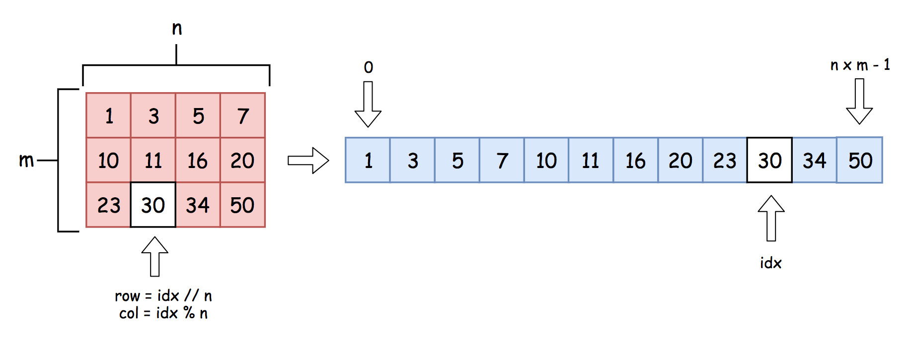

[74. Search a 2D Matrix](https://leetcode.com/problems/search-a-2d-matrix/)

* Amazon, Microsoft, Facebook, Uber, Apple
* Array, Binary Search
* Similar Questions:
    * Search a 2D Matrix II
    
    
## Method 1. My Solution
```java 
class Solution {
    public boolean searchMatrix(int[][] matrix, int target) {
        if(matrix==null || matrix.length==0) {
            return false;
        }
        
        int row = matrix.length - 1;
        int col = 0;
        while(row>=0 && col<matrix[0].length) {
            if(matrix[row][col] == target) {
                return true;
            } else if(matrix[row][col] > target) {
                row--;
            } else {
                col++;
            }
        }
        return false;
    }
}
```


## Method 2. Binary Search
前提：**The first integer of each row is larger than the last integer of the previous row.**

Convert 2D into 1D. One could notice that the input matrix `m x n` could be considered as a sorted array of length `m x n`.


`idx` 和 `row, col` 之间的转换公式： `row = idx / n, col = idx % n`

```java 
class Solution {
    public boolean searchMatrix(int[][] matrix, int target) {
        if(matrix==null || matrix.length==0) {
            return false;
        }
        
        int m = matrix.length;
        int n = matrix[0].length;
        // Binary Search
        int lo = 0;
        int hi = m * n - 1;
        int pivotIndex;
        int pivotElement;
        while(lo <= hi) {
            pivotIndex = lo + (hi - lo) / 2;
            pivotElement = matrix[pivotIndex / n][pivotIndex % n];
            if(target == pivotElement) {
                return true;
            } else if(target < pivotElement) {
                hi = pivotIndex - 1;
            } else {
                lo = pivotIndex + 1;
            }
        }
        return false;
    }
}
```


