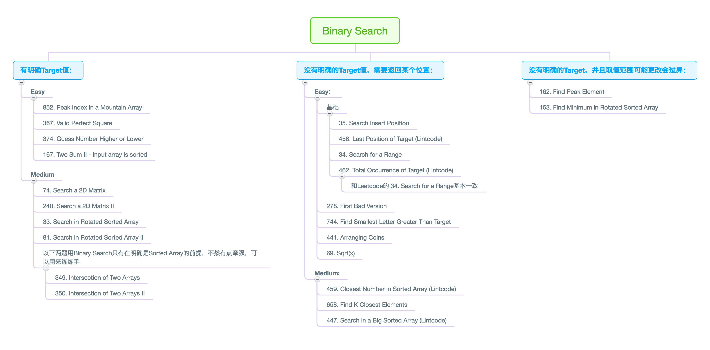

二分法查找是作用于 **sorted** 序列的。   
首先将要查找的元素与中间元素进行比较，
如果大于中间元素，就在当前序列的后半部分继续查找；
如果小于中间元素，就在当前序列的前半部分继续查找；
直到找到相同的元素为止。


## 2. Binary Search 痛点

### 2.1 溢出
`mid = (left + right) / 2;`
1. 在对两个 signed 32-bit 数字进行相加的时候，有可能出现溢出；比如  `left=1` and `right=Integer.MAX_VALUE`；
2. 当left和right之和超过所在类型的表示范围的话，这个和就是一个很随机的值，那么mid就不会得到正确的值。

所以，更稳妥的做法是
```bash
mid = left + (right - left) / 2;
mid = left + ((right - left) >> 1);
```

### 2.2 边界错误
> 二分法查找法的边界一般来说分为两种情况：左闭右开，即`[left, right)`；左闭右闭，即`[left, right]`。    

> 需要注意的是，循环体外的初始化条件，与循环体内的迭代条件，都必须遵守**一致的区间规则**。
也就是说，如果循环体初始化时，是以左闭右开区间为边界的，那么循环体内部的迭代也应该如此。如果两者不一致, 会造成程序的错误。

#### 2.2.1 Wrong Example
下面是个错误的例子：      
Wrong Example: 
```python
def binarySearch(arr, target):
    l = 0
    r = len(arr)
    while l < r:
        mid = (l + r) // 2
        if arr[mid] == target:
            return mid
        if target > arr[mid]:
            l = mid + 1
        else:
            r = mid - 1
    return -1
```
算法初始化的时候，搜索范围是左闭右开 `[l, r)`，
当满足 `target > arr[mid]` 的时候，更新 `l = mid + 1;`，因为 `arr[mid]` 不可能是 `target`，所以继续在 `[mid+1, r)` 中搜索是正确的；
当满足 `target < arr[mid]` 的时候，更新 `r = mid - 1;`，所所范围就变成了 `[l, mid - 1)`，然而从判断条件可以得出 `arr[mid] != target`，但是不能确定 `arr[mid-1]` 是否为 `target`，而新的搜索范围就会跳过 `arr[mid-1]`，这将导致错误。

#### 2.2.2 左闭右闭: [l, r], end inclusive
正确的左闭右闭 `[l, r]` 写法：
```python
def binarySearch(arr, target):
    """
    定义：在[l...r]的范围里寻找target, 因为这里定义是需要将r归入范围区间, inclusive，所以while循环的边界需要包含r
    :param arr:
    :param target:
    :return:
    """
    l = 0               # index of the first element
    r = len(arr) - 1    # index of the last element
    while l <= r:
        mid = l + (r - l) / 2
        if arr[mid] == target:
            return mid
        elif target > arr[mid]:
            l = mid + 1     # 明确区间的要求，只要使用过的，一律绕过。
        else:
            r = mid - 1     # 明确区间的要求，只要使用过的，一律绕过。
    return -1
```
* 外循环的条件是在 `[l, r]` 范围内寻找，也就是包括 `r`，所以循环条件应该为 `while l <= r`；
* 考虑一个最极端的情况 `[l, r]`, where `l == r`, 此时两个 index 都指向同一个元素，该元素也是需要比较的，因此外循环的条件应该包括 `l == r`；
* 内循环的条件是 `l = mid + 1` 和 `r = mid - 1`，此时 `mid` 不是要找的元素，所以下一轮循环要找的范围不包括 `mid`，但是应该包括 `mid` 旁边的元素，也就是 `[mid+1, r]` and [l, mid-1]。

#### 2.2.3 左闭右开: [l, r), end exclusive
```python
def binarySearch(arr, target):
    """
    定义：在[l...r)的范围里寻找target, 因为这里定义是不需要将end归入范围区间 exclusive，
    所以while循环的边界小于End即可，因为length本身长度会比index大1相对应的，
    每次target的value小于arr[mid]的时候，我们在重新定义新的end时候，也选择exclusive的模式，r = mid即可
    :param arr:
    :param target:
    :return:
    """
    l = 0           # index of the first element
    r = len(arr)    # r-1 is the index of the last element
    while l < r:
        mid = l + (r - l) / 2
        if arr[mid] == target:
            return mid
        elif target > arr[mid]:
            l = mid + 1     # mid is not the target, so it should be exclusive
        else:
            r = mid         # mid is the right bounday, it is alreay exclusive
    return -1
```
* 外循环的条件是在 `[l, r)` 范围内寻找，也就是不包括 `r`，所以循环条件应该为 `while l < r`；
* 极端情况比如 `[l, l+1)`，此时搜索范围只有一个 element，进入循环内部后 `arr[mid] == arr[l]`，如果此时 `arr[mid] != target`，更新完搜索范围后会有两种情况：`[l+1, l+1)` or `[l, l)`，此时都会终止循环；
* 内循环的条件是 `l = mid` 和 `r = mid`，此时 `mid` 不是要找的元素，所以下一轮循环要找的范围不包括 `mid`，但是应该index 为 `mid` 的元素不在循环范围内，也就是 `[mid+1, r)` and [l, mid-1]。

### 2.3 死循环
> 上面的情况还只是把边界的其中一个写错，也就是右边的边界值写错，如果两者同时都写错的话，可能会造成死循环。
```python
def binarySearch(arr, target):
    """
    只是把边界的其中一个写错，也就是右边的边界值写错，如果两者同时都写错的话，可能会造成死循环。
    :param arr:
    :param target:
    :return:
    """
    l = 0
    r = len(arr) - 1    # inclusive
    while l <= r:
        mid = l + (r - l) / 2
        if arr[mid] == target:
            return mid
        elif target > arr[mid]:
            l = mid
        else:
            r = mid
    return -1
```
外循环 `while-loop` 的条件，采用的是左闭右闭 `[l, r]` 的区间，但是
* 当 `target < arr[mid]` 的时候，那么下一次查找的区间应该为 `[l, mid-1]`，而上述代码中却是 `[l, mid]`；
* 当 `target > arr[mid]` 的时候，那么下一次查找的区间应该为 `[mid+1, r]`，而上述代码中却是 `[mid, r]`;
* 如果 `l == r`，并且 `arr[l] == arr[r] == arr[mid] != target`, 此时无论更新左边界或右边界，搜索范围都不会改变，因而出现 Dead Loop。
因此，有可能出现某次查找时始终在这两个范围中轮换，造成了程序的死循环。


## 3. Templates
模板尽量符合一致性的观点；并且要有自己熟悉的模板。

### 3.1 常用模板
95% 的情况下会用这种模板。
```python
def binarySearch4(arr, target):
    """
    采用 [l, r] 的搜索范围。
    :param arr: 
    :param target: 
    :return: 
    """
    l = 0
    r = len(arr) - 1
    while l <= r:
        mid = l + (r - l) / 2
        if target == arr[mid]:
            return mid
        elif target > arr[mid]:
            l = mid + 1
        else:
            r = mid - 1
    return -1
```
* 此时采用的是 `[l, r]`，左右边界都在搜索范围内，因此当 `arr[mid] != target` 的时候，可以直接跳过 `mid`，采用 `l = mid + 1` or `r = mid - 1`。

### 3.2 备用模板
针对第一个模板的短板
```python
def binarySearch(arr, target):
    """
    [l, r]
    i.e. l <= r,
    :param arr:
    :param target:
    :return:
    """
    l = 0
    r = len(arr) - 1
    while l+1 < r:  # i.e. l < r - 1,
        mid = (l + r) // 2
        if target == arr[mid]:
            return mid
        elif target > arr[mid]:
            l = mid
        else:
            r = mid
    
    if arr[l] == target:
        return l
    if arr[r] == target:
        return r
    return -1
```
第二个模板专门针对的是第一个模板的短板：当要 access 数组边界的数，如果边界的数在运行中出现更改，可能越界。虽然这种情况也可以用 `Edge Case` 来写，但太过麻烦。
* 搜索范围是 `[l, r]`, 终止条件是 `[l, l+1]`；
* 可以用于模糊搜索，如大于 target 的最小的数是多少，小于 target 的最大的数是多少等。


## 4. Binary Search 题型


### 4.1 有明确的 Target 的题型
[367.  Valid Perfect Square]()     
[33. Search in Rotated Sorted Array]()


### 4.2 没有明确的 Target 的题型
[边界处理图像化网站](http://pythontutor.com/visualize.html#mode=edit)
这一类的题比较多变，可能会要你找
* 比Target大的最小值
* 比Target小的最大值
* 满足要求的第一个值
* 不满足要求的最后一个值
* ...

思考下面的模板，在迭代退出的时候，`left` 和 `right` 的位置：  


#### case 1: `arr = [1, 2, 3, 5, 6], target = 4`   
     
根据模板代码中对 while-loop 的定义 `while l <= r:`，也就是只用 `l > r` 的时候，while-loop 才会终止。
* Steps:
    1. l=0, r=4, => mid=(0+4)/2=2, target=4 > arr[mid]=3, therefore l=mid+1=3;
    2. l=3, r=4, => mid=(3+4)/2=3, target=4 < arr[mid]=5, therefore r=mid-1=2;
所以迭代结束后，`l` 和 `r` 的位置分别对应两个条件：
* `l`对应的是：第一个比4大的坐标, 根据这道题的定义就是比Target大的最小值，也就是 5；
* `r`对应的是：最后一个比4小的坐标，根据这道题的定义就是比Target小的最大值，也就是 3。

#### case 2: `arr = [1, 2, 3, 5, 6], target = 7`
根据 while-loop 的特性，有个 edge 的情况是，`l` 最大可以等于 `len(arr)`
   
* Steps:
    1. l=0, r=4, => mid=(0+4)/2=2, target=7 > arr[mid]=3, therefore l=mid+1=3;
    2. l=3, r=4, => mid=(3+4)/2=3, target=7 > arr[mid]=5, therefore l=mid+1=4;
    3. l=4, r=4, => mid=(4+4)/2=4, target=7 > arr[mid]=6, therefore l=mid+1=5; ==> over the bounday
可以看出，如果要返回 `arr[l]` 则会出现系统报错，因为 `l` 已经越界，这就是这个模板的局限性。所以要记住这一点，要对相应的 edge case 处理。

* 返回 `l` 的情况
[33. Search in Rotated Sorted Array]()

* 返回 `r` 的情况
[458. Last Position of Target (Lintcode)]()

* 上两题的合体
[34. Search for a Range]()

### 4.3 没有明确的 Target 的题型，可越界类型
这种类型的题目，用 `l <= r` 的模板可能会越界，我们可以填写个别的Edge Case处理，或者套用其他比如 `l < r` 或者 `l + 1 < r`的模板解决。

[162. Find Peak Element]()     
[153. Find Minimum in Rotated Sorted Array]()


## Reference:
1. [Binary Search的总结帖](https://www.1point3acres.com/bbs/thread-432793-1-1.html)
2. [二分查找学习札记](http://www.cppblog.com/converse/archive/2009/10/05/97905.aspx)
3. [Search in Rotated Sorted Array 解题报告 ](http://fisherlei.blogspot.com/2013/01/leetcode-search-in-rotated-sorted-array.html)
